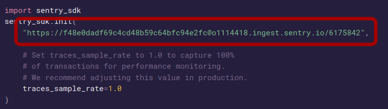

# P13_Scale-a-Django-application-using-a-modular-architecture
***
## Table of contents
1. [Program surroundings](#program-surroundings)
2. [The five principal aims of this project](#the-five-principal-aims-of-this-project)
3. [Used configuration](#used-configuration)
4. [Get and launch the app in local](#Get-and-launch-the-app-in-local)
5. [Deployment](#deployment)  
    5.a. [Principles of deployment](#principles-of-deployment)  
    5.b. [Configuration](#configuration)  
      * [Accounts](#accounts)    
      * [Setup](#setup)  
  
    5.c. [Usage](#usage)  
***

## Program surroundings 

This program is the last of thirteen projects to be validated in order to get a degree as a developer in Python applications.  

For more info on that subject please visit the following website:  
https://openclassrooms.com/fr/paths/322-developpeur-dapplication-python
  

## The five principal aims of this project 
* Refactor an app to minimize the technical debt
* Apply a modularity architecture in a Python app
* Use CircleCI to manage the production of code with the CI/CD methodology
* Deploy the app with Heroku
* Use Sentry to set up a system of code control

## Used configuration 
OS: Linux Mint 20.2 Cinnamon 5.0.7  
Python: 3.8.10 (default, Nov 26 2021, 20:14:08)  
Django: 3.2.6  

## Get and launch the app in local 
* Clone the repository  
  * `cd /path/to/put/project/in`  
  * `git clone https://github.com/oliviersamin/P13_Scale-a-Django-application-using-a-modular-architecture.git`

* Create the virtual environment
  * `cd /path/to/Python-OC-Lettings-FR`
  * python3 -m venv env
  * activate the virtual environment: `source env/bin/activate`
  * `pip install -r requirements.txt`

* Launch the app
    * `cd /path/to/Python-OC-Lettings-FR`
    * `source venv/bin/activate`
    * `python manage.py runserver`
    * Go on http://localhost:8000 in a web browser.

## Deployment
This section explains what is a CI/CD pipeline and how to configure it to deploy your app.

#### Principles of deployment
* The idea of the continuous integration and deployment is to check and apply automatically all the changes of your code on your internet app.  
  They are applied to your final application on the internet, the app's errors are monitored as well.  
The following schema explains how this pipeline is build. Let's detail it.

* First use GitHub to store the code of your project (here clone the repo of this project in your GitHub repo)  

* Then use CircleCI to generate and manage a CI/ CD pipeline.    
The aim is that all the changes made on GitHub are applied automatically on your internet app and errors monitored.  
Each time a modification is made on the GitHub repo, the CI/CD pipeline will start.  
This pipeline allows you to provide continuous integration and delivery for this project.  
The pipeline includes the usual steps for continuous integration and delivery:
1. compile the code
2. lint the code
3. test the code
4. build a docker image using the new code
5. push the docker image to Dockerhub
6. push the docker image to Heroku
7. deploy the Heroku app on internet
8. monitor the errors with Sentry

#### Configuration
Regarding the steps of the pipeline in the previous section, the required configuration is as follows:

###### Accounts
* Get a GitHub account
* Get a Docker account
* Get a CircleCI account: signup with GitHub to link directly all your GitHub repo to CircleCI
* Get a Heroku account
* Get a Sentry account

###### Setup
Now that the accounts are created, let's detail how to set up the pipeline regarding each account.

1. On DockerHub: 
* create a new repository to store the future images created by the CircleCI pipeline.

2. On Sentry: 
* create a project
* select the "Python" platform
* click on "create project" , the following code appears.
  
* copy the url circled in red (without the quotes)
  
* save it somewhere to use it later in environment variables of Heroku

3. On Heroku: 
* create a new pipeline 
* in this pipeline create a new app in the production section
* in this new app click on "Settings" --> "Reveal Config Vars"
* enter a new environment variable 
  * NAME = SENTRY_DSN
  * VALUE = url copied from Sentry

4. On GitHub:
* create a new repository
* clone the actual repo in your GitHub repository

5. On CircleCI:
* Connect to CircleCI using via GitHub

* Choose the GitHub repo corresponding to the project

* A .circleci folder and a .yml file (which is the configuration file) are already in the cloned repo.  
  The config file sets up the pipeline and all the needed steps to apply all your code changes automatically to your internet app.

* The config file of CircleCI is made of two parts:
    * the first one is the creation of jobs (tasks) that will be executed.  
In the actual config file there are 3 jobs: "compile-linting-tests", "build_and_push_docker_image" and "deploy_to_Heroku".  
Here is the example of the compile-linting-tests job.  
      
For each job you must indicate a docker image to use (in red on the example) and steps to perform.  
  It can be prebuilt steps such as the one in blue on the example or customized one like the one in yellow on the example.
  * the second one is the execution of the previous tasks in a workflow.   
Here is an example of workflow.  
      
In this example the workflow is named "project_13".  
    It is made of jobs previously build. Each job can take parameters.
The context parameter allows using environment variables setup in CircleCI.  
The "filters" and "branch" parameters indicates to the workflow that the job is executed only if you are in the required branch of your GitHub repo.  
    In this example if we are in the pipeline_CI_CD branch then the job will be executed.  
The "requires" parameter indicates to the workflow that the job will be executed only if the required job has been successful.  
In this example if the compile-linting-tests job is successful, then the build_and_push_docker_image will be executed.  

* Environment variables: Some have default names such as "$CIRCLE_SHA1" and other must be defined by the user. 
  There are several ways to do it. 
  The way it has been done in the actual config file is by defining them in the "Organization Settings" --> "Contexts". 
  A new context has been created named "Basic secured data" in which all needed environment variables are defined.  
  In the previous example of the workflow, one can see that the context is used to get the environment variables.  
The environment variables used in the actual config files are:  
    * Docker_tag_image : name of the DockerHub repository.  
Example: if your dockerHub repo is accessible on the following url "https://hub.docker.com/repository/docker/<USER_NAME>/<REPO_NAME>" then Docker_tag_image = <USER_NAME>/<REPO_NAME>
    * $Docker_username : username to connect to DockerHub
    * $Docker_password : password to connect to DockerHub
    * $HEROKU_APP_NAME : the name of the app you choose on Heroku, here this is oc-lettings-os

#### Usage

1. Once the pipeline is set up, one may try to change something in the GitHub repo.  
   As soon as the change is validated in GitHub, the CI/CD pipeline is launched by CircleCI.

2. Once the pipeline has been successfuly executed, a new docker image appears in DockerHub and a new release appears in Heroku.

3. To open the app on internet click on the 'open app' button of your Heroku application.  
   
4. Once the app is launched, go to the URI /sentry-debug. An error should appear on the site.  

5. Go on your Sentry repo and click on the "issues" button. You should see the corresponding issue appearing.

   
